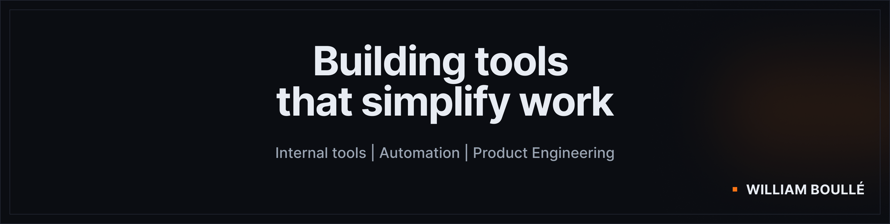

  

  
  

---

## What I do

Full-stack developer focused on **internal tools, automation and product engineering**.

I enjoy turning **messy processes into simple software** that teams actually use.

Typical things I build:

- internal tools
- workflow automation
- product-oriented web applications
- API integrations

---

## Things I'm building

**Skann Livres**  
App to track borrowed books and avoid forgotten returns.

**ImmoLens**  
Dashboard to manage short-term rental properties.

**Temalatailledurat**  
SEO / GEO experiment exploring referral codes and affiliate traffic.

---

## Stack

Symfony • Angular • TypeScript • APIs • PostgreSQL

---

## Freelance

Available for **part-time freelance missions**.

I usually help teams:

- build internal tools
- automate workflows
- add features to existing platforms
- integrate APIs and external services

---

## Links

🌐 Website  
https://williamboulle.fr

💼 Malt  
https://www.malt.fr/profile/williamboulle

💼 LinkedIn  
https://www.linkedin.com/in/william-boulle
